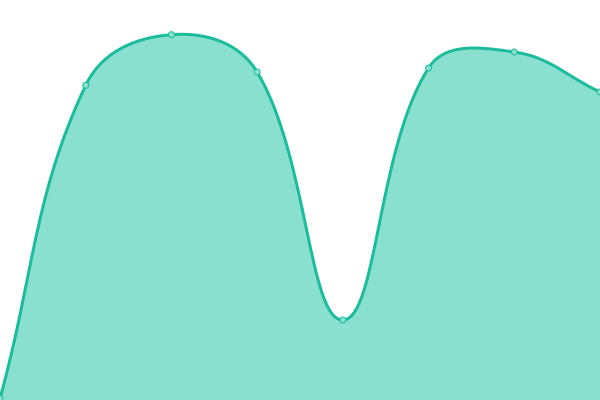
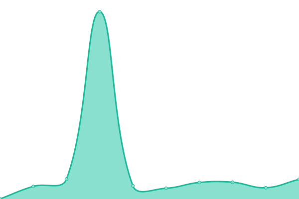

# [📈 Live Status](https://oparacriacoes.github.io/upptime): <!--live status--> **🟩 All systems operational**

This repository contains the open-source uptime monitor and status page for [oparacriacoes](https://oparacriacoes.github.io/upptime), powered by [Upptime](https://github.com/upptime/upptime).

With [Upptime](https://upptime.js.org), you can get your own unlimited and free uptime monitor and status page, powered entirely by a GitHub repository. We use [Issues](https://github.com/oparacriacoes/upptime/issues) as incident reports, [Actions](https://github.com/oparacriacoes/upptime/actions) as uptime monitors, and [Pages](https://oparacriacoes.github.io/upptime) for the status page.

<!--start: status pages-->
<!-- This summary is generated by Upptime (https://github.com/upptime/upptime) -->
<!-- Do not edit this manually, your changes will be overwritten -->
<!-- prettier-ignore -->
| URL | Status | History | Response Time | Uptime |
| --- | ------ | ------- | ------------- | ------ |
|  [Ajor](https://www.ajor.org.br) | 🟩 Up | [ajor.yml](https://github.com/oparacriacoes/upptime/commits/HEAD/history/ajor.yml) | 

 403ms
     
 | 

<a href="https://oparacriacoes.github.io/upptime/history/ajor">100.00%</a>
    

|  [Ponte](https://ponte.org) | 🟩 Up | [ponte.yml](https://github.com/oparacriacoes/upptime/commits/HEAD/history/ponte.yml) | 

 188ms
     
 | 

<a href="https://oparacriacoes.github.io/upptime/history/ponte">100.00%</a>
    

|  [Sumauma](https://sumauma.com) | 🟩 Up | [sumauma.yml](https://github.com/oparacriacoes/upptime/commits/HEAD/history/sumauma.yml) | 

 130ms
     
 | 

<a href="https://oparacriacoes.github.io/upptime/history/sumauma">100.00%</a>
    

|  [Agenda Preta](https://agendapreta.com) | 🟩 Up | [agenda-preta.yml](https://github.com/oparacriacoes/upptime/commits/HEAD/history/agenda-preta.yml) | 

 367ms
     
 | 

<a href="https://oparacriacoes.github.io/upptime/history/agenda-preta">100.00%</a>
    

|  [O Joio e o Trigo](https://ojoioeotrigo.com.br/) | 🟩 Up | [o-joio-e-o-trigo.yml](https://github.com/oparacriacoes/upptime/commits/HEAD/history/o-joio-e-o-trigo.yml) | 

 204ms
     
 | 

<a href="https://oparacriacoes.github.io/upptime/history/o-joio-e-o-trigo">100.00%</a>
    

<!--end: status pages-->

[**Visit our status website →**](https://oparacriacoes.github.io/upptime)

## 📄 License

- Powered by: [Upptime](https://github.com/upptime/upptime)
- Code: [MIT](./LICENSE) © [oparacriacoes](https://oparacriacoes.github.io/upptime)
- Data in the `./history` directory: [Open Database License](https://opendatacommons.org/licenses/odbl/1-0/)
